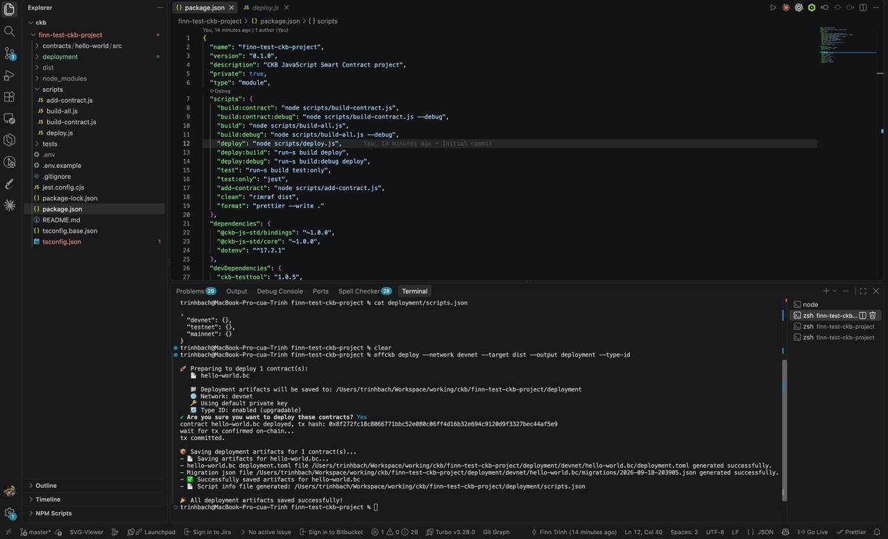
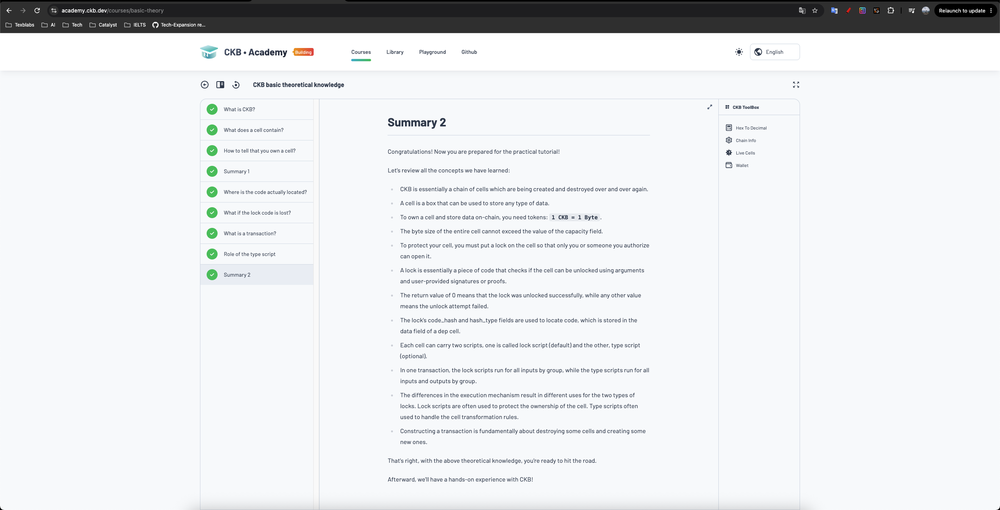
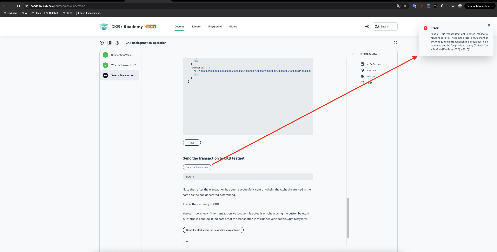

# Week 1 — week ending 2026-09-27

**Name:** Trinh Bach · **Track:** CKBuilders
**Focus:** CKB fundamentals, the Cell model, and a first working dev environment

## 1. Covered this week

| Item | Status |
|---|---|
| [Introduction to Nervos CKB](https://docs.nervos.org/docs/ckb-fundamentals/nervos-blockchain) | Done |
| [Getting started on CKB](https://docs.nervos.org/docs/getting-started/how-ckb-works) — networks & RPCs | Done |
| [Quick start](https://docs.nervos.org/docs/getting-started/quick-start) — dev environment with OffCKB | Done |
| [CKB Academy](https://academy.ckb.dev/courses) — Lesson 1: basic theoretical knowledge | Done |
| [CKB Academy](https://academy.ckb.dev/courses) — Lesson 2: basic practical operation | Partial — broadcast rejected, see §4 |
| [Introduction to Script](https://docs.nervos.org/docs/script/intro-to-script) | Done |

## 2. Key learnings

**Architecture**

- CKB splits the trilemma across layers: **L1 for security and decentralisation, L2 for scale**. Consensus is PoW (**NC-MAX**), documented as roughly 10x Ethereum's throughput, with more expected once L2 matures.
- Scripts run on **CKB-VM**, which executes the **RISC-V** ISA — RISC-V is the instruction set, not the VM. Scripts can be written in Rust, C or JavaScript.

**Cell model** — the biggest shift from an account-based background

- A **Cell** holds `capacity`, `data`, a mandatory **lock script** and an optional **type script**. State is a set of Cells, not accounts with balances.
- **CKB is both the token and the storage capacity backing a Cell: 1 CKB = 1 byte.** A Cell's total size cannot exceed its `capacity`; storing data locks CKB, freeing it releases them.
- A Cell therefore has a **minimum capacity of 61 CKB** even when it carries no data, and in practice should hold **62 CKB or more** so there is room to pay the fee. Any `data` is paid for on top of that, so dust-sized Cells are impossible by design.
- Cells are immutable. Changing state means **consuming old Cells and creating new ones**, so a transaction is `Input Cells → validation → Output Cells`, and the chain is a continuous cycle of Cells created and destroyed.
- **Lock = ownership**: validates args plus the user's signature/proof. **Return 0 unlocks; any non-zero value fails the transaction.**
- **Type = state transition rules**: validates how a Cell may be transformed.
- `code_hash` + `hash_type` do **not** contain code — they locate it, and the real code lives in the `data` of a dep cell. Least intuitive part so far.
- Lock scripts are grouped and executed **per inputs**; type scripts across the **related inputs and outputs**. That execution difference is exactly why their responsibilities differ.
- **Cycles** measure a Script's computational cost, and each block has a total cycle limit.
- The **mempool** holds valid but unmined transactions; each node keeps its own and propagates to peers.

**Mental model going forward:** nothing is updated on CKB, everything is replaced. Ownership is proven by code (lock), validity of the change is proven by code (type).

## 3. Practical progress

- **Local dev environment running, and deployed a Script to devnet.** Scaffolded a CKB JavaScript smart contract project (`@ckb-js-std`), built `hello-world.bc` and deployed it with OffCKB:

  ```
  offckb deploy --network devnet --target dist --output deployment --type-id
  ```

  Deployed with Type ID enabled (upgradable), the tx was committed on the devnet, and the deployment artifacts (`deployment.toml`, migration json, `scripts.json`) were generated.
  

- **Completed CKB Academy Lesson 1** end to end, through Summary 2.
  

- **CKB Academy Lesson 2, up to the last step.** Connected a wallet, built the transaction and read the raw JSON (inputs, `outputsData`, `witnesses`). The final broadcast to the testnet was rejected by the node — see §4.
  

## 4. Blockers / questions

**I could not finish the transaction in Academy Lesson 2.**

When I clicked Connect, the page went straight to Trust Wallet — there was no list to choose from, and the wallet I actually use, UTXO Global, was never offered. Trust Wallet is also not in the supported Wallets list on [docs.nervos.org](https://docs.nervos.org/). I then could not get any testnet CKB onto that address from the faucet, so when I sent the transaction the node rejected it:

```
code: -1104  PoolRejectedTransactionByMinFeeRate
The min fee rate is 1000 shannons/KW, requiring a transaction fee of at least 466 shannons,
but the fee provided is only 0        data: LowFeeRate(FeeRate(1000), 466, 0)
```

With an empty address there was nothing to cover the fee, which matches the "fee provided is only 0" in the error. Next step is to fund a supported wallet from the faucet and redo the lesson.

**Question:** is the wallet connection on the Academy page meant to offer a choice of wallets, or is connecting straight to Trust Wallet the expected behaviour?
