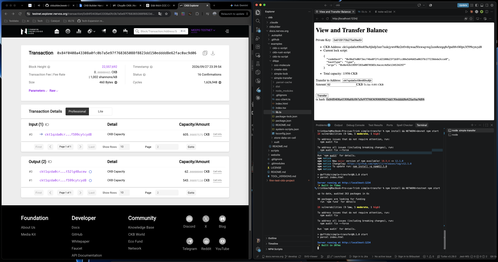
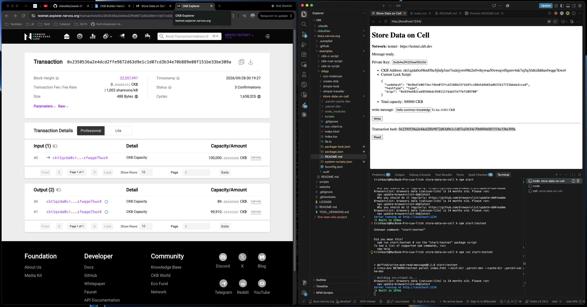
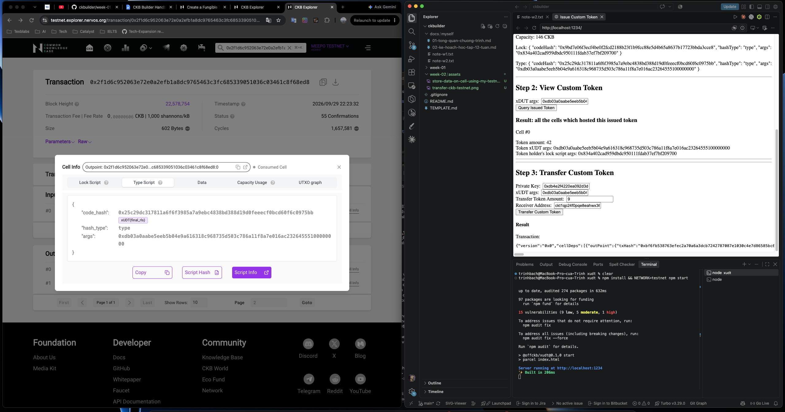
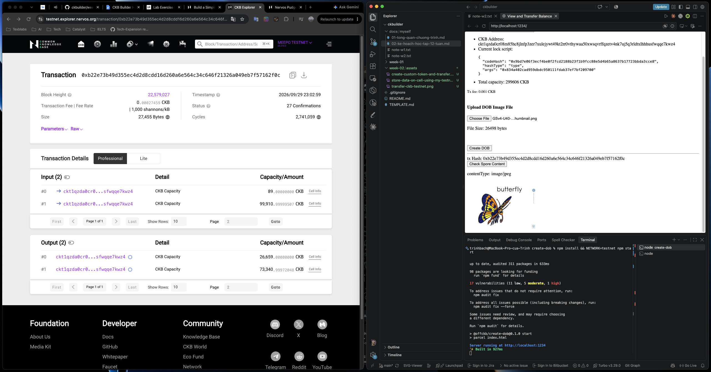
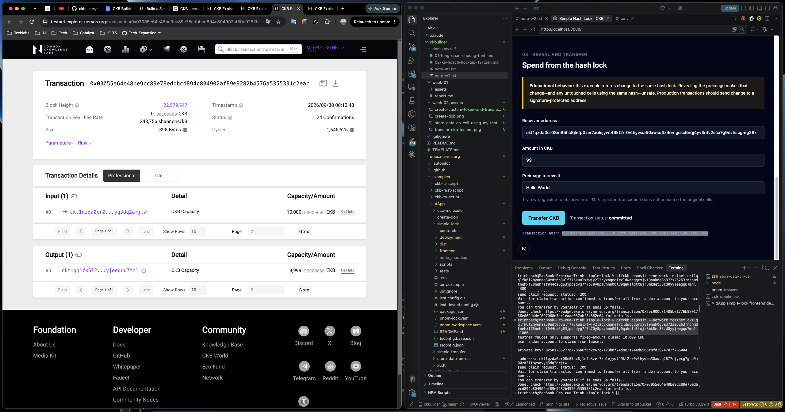
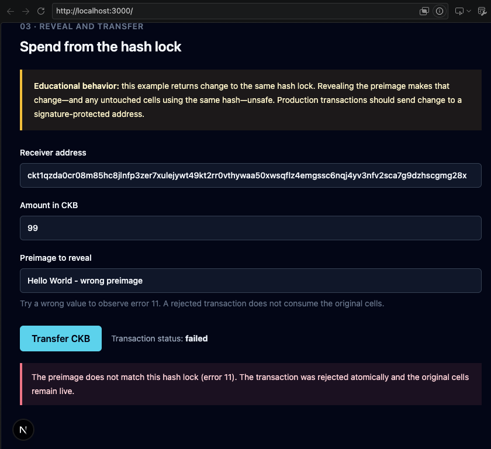
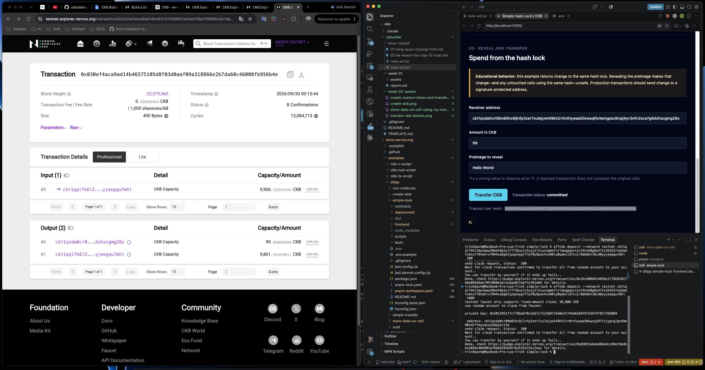
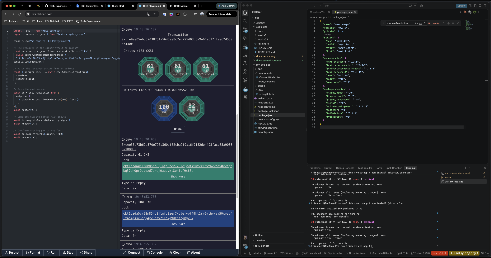
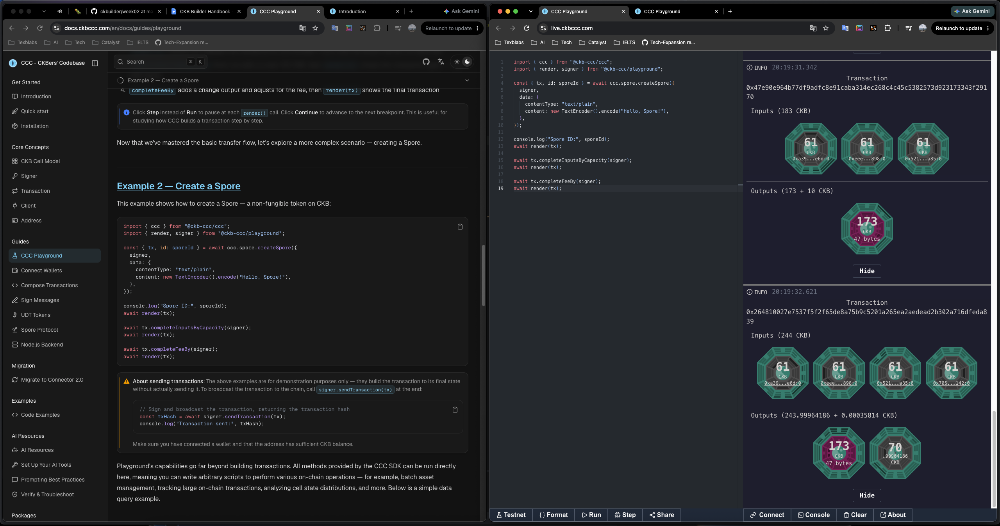
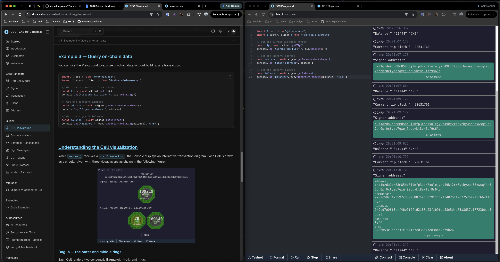

# Week 2 — week ending 2026-10-04

**Name:** Trinh Bach · **Track:** CKBuilders
**Focus:** The five beginner dApp tutorials on testnet, and the CCC SDK

## 1. Covered this week

| Item | Status |
|---|---|
| [Transfer CKB](https://docs.nervos.org/docs/dapp/transfer-ckb) | Done |
| [Store Data on Cell](https://docs.nervos.org/docs/dapp/store-data-on-cell) | Done |
| [Create Fungible Token](https://docs.nervos.org/docs/dapp/create-token) | Done |
| [Create DOB](https://docs.nervos.org/docs/dapp/create-dob) | Done |
| [Build a Simple Lock](https://docs.nervos.org/docs/dapp/simple-lock) | Done |
| [CCC docs](https://docs.ckbccc.com/) — Introduction, Quick start, Installation | Done |
| CCC concepts — [Cell model](https://docs.ckbccc.com/en/docs/concepts/cell-model), [Signer](https://docs.ckbccc.com/en/docs/concepts/signer), [Transaction](https://docs.ckbccc.com/en/docs/concepts/transaction), [Client](https://docs.ckbccc.com/en/docs/concepts/client), [Address](http://docs.ckbccc.com/en/docs/concepts/address) | Done |
| [CCC Playground](https://docs.ckbccc.com/en/docs/guides/playground) — examples 1–3 | Done |

## 2. Key learnings

**CCC**

- CCC (Common Chains Connector) is a TypeScript SDK for wallet connections, transaction composition and cross-chain signing. It also hosts the RGB++ SDK (issue assets on BTC L1 backed by CKB's VM) and the Spore SDK (DOBs).
- `ccc.Signer` is the one abstraction for signing across CKB, EVM, BTC, Nostr and Doge wallets, so the same app code works with any of them.
- `KnownScript` lists the pre-deployed scripts CCC can resolve on mainnet and testnet, so I don't have to look up `codeHash` and `cellDeps` by hand.
- Building a transaction is two calls after describing the outputs: `completeInputsByCapacity` picks input Cells, `completeFeeBy` adds the fee and change.
- 1 CKB = 100,000,000 shannons, and fees are tiny in those units. An `OutPoint` (`txHash` + `index`) is what identifies a Cell on-chain.

**What the tutorials showed**

- **Capacity is real storage.** The DOB image was 26,498 bytes and its Cell holds 26,659 CKB. In the CCC Playground, a Spore with only 47 bytes of data still needs a 173 CKB Cell, because the lock and type script live in the Cell and count toward capacity too.
- **Tokens are Cells, not balances.** The xUDT amount sits in the data of a Cell whose type script defines the token; its `args` identify which token it is. Transferring 9 consumed that Cell and created new ones.
- **A lock is just code, not only a signature check.** In the hash lock, anyone who reveals the right preimage can spend. A wrong preimage fails with error 11, the whole transaction is rejected and the original Cells stay live. The tutorial warns that revealing the preimage makes the change returned to the same lock unsafe.
- **Script cost shows up in cycles.** The hash lock spend used about 13.1M cycles, against about 1.6M for the plain transfer and store-data transactions.

## 3. Practical progress

- **Transfer CKB.** Sent 62 CKB on testnet from the tutorial app and confirmed it on the explorer: one input, two outputs (62 CKB to the receiver, the rest back as change).
  

- **Store Data on Cell.** Wrote a message into a Cell with my testnet wallet.
  

- **Create Fungible Token.** Issued a custom xUDT token, queried the Cell holding it, and transferred 9 tokens. The explorer shows the xUDT type script on the Cell.
  

- **Create DOB.** Uploaded an image (butterfly) as a Spore on testnet and read its content back.
  

- **Build a Simple Lock.** Deposited testnet CKB into the hash lock, then tried to spend it twice. With a wrong preimage the transaction failed (error 11); with the correct one it committed.
  
  
  

- **CCC.** Scaffolded `my-ccc-app` (Next.js), installed the CCC packages, and ran the Playground examples: build a transfer, create a Spore, and query on-chain data (tip block, address, balance).
  
  
  

## 4. Blockers / questions

None this week.
